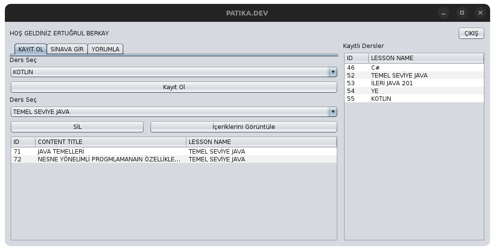
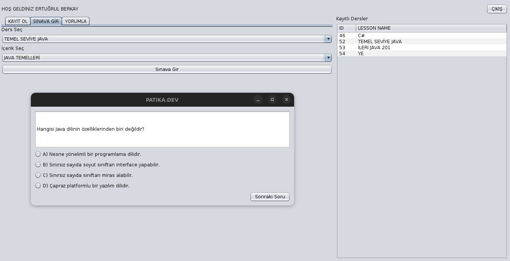
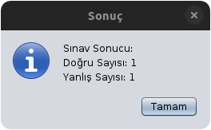
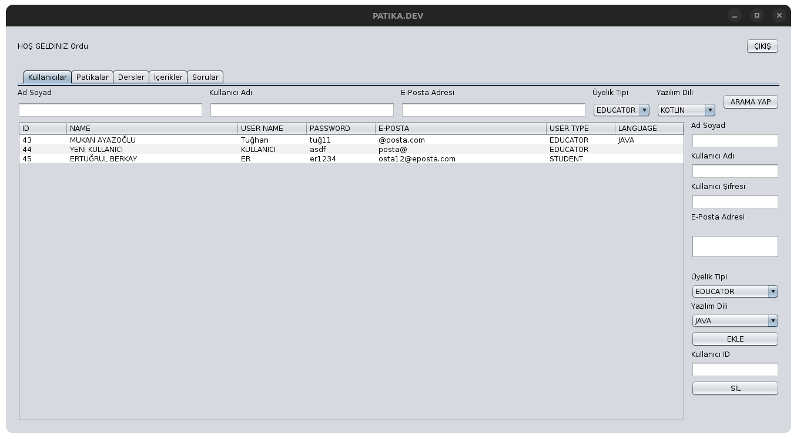
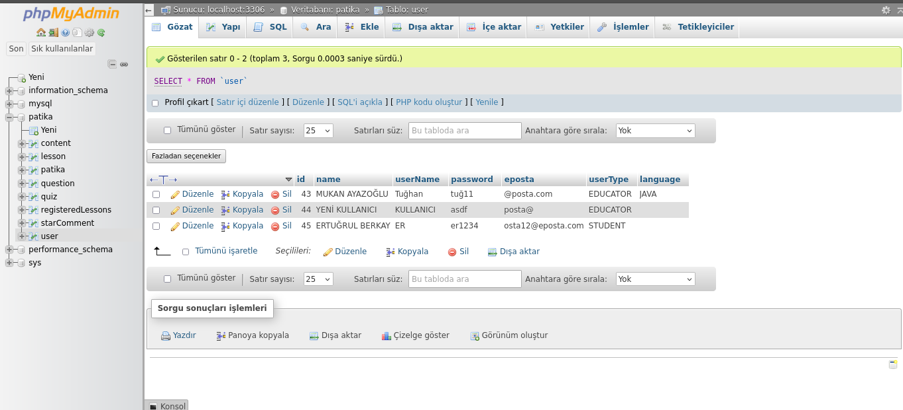
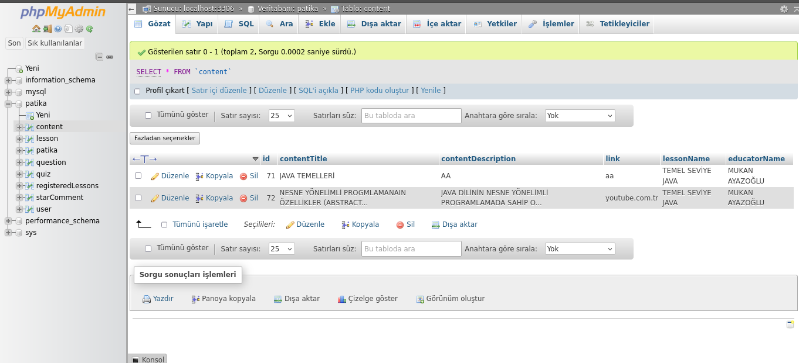

# Used Technologies

###  Java
###  Swing
###  JDBC
###  MySQL

## Features
### Login Panels

- Authentication: Users can log in with their name/e-posta and password. Students and educators can also sign in.

  
  

### Student Panels

- Student Actions: Students can join contents, write comments, rate the related course educators, and solve quizzes.

  
  
  
  

### Educator Panels

- Educator Responsibilities: Educators can add  contents and quizzes assigned to their path.

  
  
  
  

### Operator Panels

- Operator Duties: Operators can register educators and students and manage them. They have admin 
  permissions.

### Some Database Screenshots

